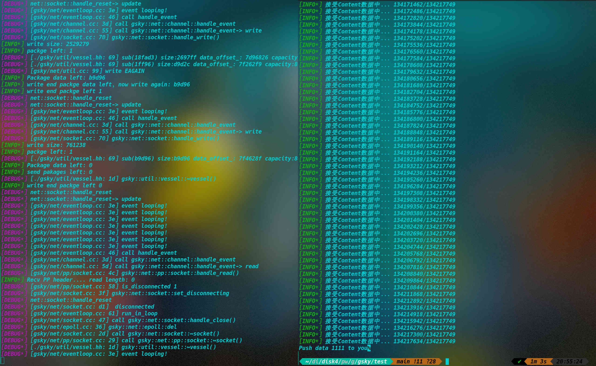

# 测试


##  发送大包与接收大包测试

客户端发送比较大的包，服务端响应比较大的包

客户端请求源码:

```cpp
#include <iostream>
#include <sys/socket.h>
#include <netinet/in.h>
#include <arpa/inet.h>
#include <cstring>
#include <unistd.h>
#include <gsky/crypto/pe.hh>
#include <gsky/util/vessel.hh>
#include <gsky/net/pp/pp.hh>
#include <gsky/log/log.hh>
#include <memory>

using namespace gsky::crypto;
using namespace gsky::net;
using namespace gsky::util;

class pp_client {
public:
    pp_client() {}
    ~pp_client() {
        if(fd_ != -1) {
            close(fd_);
        }
    }

    bool connect(const std::string &ip, unsigned short port) {
        fd_ = socket(AF_INET, SOCK_STREAM, 0);
        bool ret = false;
        do {
            if(fd_ < 0) {
                perror("perror:");
                break;
            }
        
            struct sockaddr_in addr;
            bzero(&addr, sizeof(struct sockaddr));
            addr.sin_family = AF_INET;
            addr.sin_port = htons(port);
            addr.sin_addr.s_addr = inet_addr(ip.c_str());
    
            socklen_t address_len = sizeof(sockaddr);
            if(::connect(fd_, (struct sockaddr *)&addr, address_len) < 0) {
                perror("connect:");
                break;
            }

            pp::header header;
            memset(&header, 0, sizeof(pp::header));
            header.magic = 0x5050;
            header.status = (unsigned char)pp::status::connect;
            header.type = (unsigned char)pp::data_type::binary_stream;
            write(fd_, &header, sizeof(pp::header));

            read(fd_, &header, sizeof(pp::header)); // read header
            if(header.magic != 0x5050) {
                error() << "connect error\n";
                break;
            }

            unsigned char key[8] = {0};
            pe().decode(key, &header.route, 8);
            memcpy(code_, header.code, 2);

            read(fd_, key_, 8); // read key
            pe().decode(key, key_, 8); // decrypt key

            ret = true;
        } while(false);

        return ret;
    }

    void send(char route[6], const std::string &data)  {
        if(fd_ == -1) {
            return ;
        }
        pp::header header;
        memset(&header, 0, sizeof(pp::header));
        header.magic = 0x5050;
        header.status = (unsigned char)pp::status::data_transfer;
        header.type = (unsigned char)pp::data_type::binary_stream;
        header.length = htonl(data.size());

        memcpy(header.code, code_, 2);
        memcpy(header.route, route, 6);

        std::shared_ptr<vessel> send_buffer = std::shared_ptr<vessel>(new vessel);
        
        send_buffer->append(&header, sizeof(pp::header));
        *send_buffer << data;

        pe().encode(key_, send_buffer->data() + 8, 8);
        pe().encode(key_, send_buffer->data() + 16, send_buffer->size() - 8);
        
        while(send_buffer->size() > 0) {
            sleep(0.2);
            info() << "发送数据中...left: " << send_buffer->size() << "\n";
            int write_len = write(fd_, send_buffer->data(), send_buffer->size());
            if(write_len < 0) {
                continue;
            }else if (write_len == 0) {
                break;
            }
            send_buffer->sub(write_len);
        }
    }
    std::shared_ptr<vessel> recv() {
        std::shared_ptr<vessel> recv_buffer = std::shared_ptr<vessel>(new vessel);
        pp::header header;
        do {
            int read_len = -1;
            while (read_len < 0) {
                info() << "接受头部数据中...\n";
                read_len = read(fd_, &header, sizeof(pp::header)); // read header
                if(read_len == 0) {
                    error() << "disconnected!\n";
                    break;
                }
                else if(read_len == sizeof(pp::header))
                    break;
            }
        
            if(!read_len) break;

            printf("read_len: %d", read_len);

            if(header.magic != 0x5050 && read_len != sizeof(pp::header)) {
                error() << "read error\n";
                break;
            }

            status_ = (pp::status)header.status;
            if(status_ == pp::status::invalid_transfer) {
                error() << "invalid_transfer\n";
            }
            printf("status %02X\n", header.status);

            pe().decode(key_, &header.route, 8);
            int length  = ntohl(header.length);
            info() << "recv length: " << length << "\n";

            int readed_len = 0;
            while(recv_buffer->size() < length) {
                char buf[1024];
                info() << "接受Content数据中... " << readed_len << "/" <<  length << "\n";
                int read_len = read(fd_, buf, sizeof(buf)); // read key
                if(read_len < 0) continue;
                if(read_len == 0) break;
                recv_buffer->append(buf, read_len);
                readed_len += read_len;
            }
            pe().decode(key_, recv_buffer->data(), recv_buffer->size()); // decrypt key
        } while(false);
        return recv_buffer;
    }

private:
    int fd_ = -1;
    unsigned char key_[8] = {0};
    unsigned char code_[2] = {0};
    pp::status status_;
};


int main() {
    pp_client ppc;    
    if(ppc.connect("43.129.244.165", 4096)) {
        info() << "连接成功!\n";
    }
    char route[] = {0x20, 0, 0, 0, 0};
    std::string a;
    a.resize(0x100000); // 发送大数据包
    //a = "hello";
    ppc.send(route, a);
    std::cout << ppc.recv()->to_string();

    return 0;
}

```


服务端响应源码:

```cpp

// g++ main.cc -lpthread -lgsky -o gsky
// ./gsky -c ../conf/gsky.conf
//
#include <iostream>
#include <signal.h>
#include <unistd.h>
#include <gsky/server.hh>

#define UNUSED(var) do { (void)(var); } while (false)

using namespace gsky;

server ser; // 创建服务器

void gsky_exit(int s) {
    UNUSED(s);
    ser.stop(); // 停止服务
}

void help() {
    std::cout << "Usage: ./gsky [OPTION...] [SECTION] PAGE...\n"
                "-c   load configure file\n"
                "-h   help of gsky server\n"
                "-v   check version of gsky server\n"
                 ;
}

enum class RouteRoot {
    TestError = 0x00,
    TestEcho = 0x10,
    TestPush = 0x20,
    TestMultiPush = 0x30,
};

// 服务器回调函数, 函数格式为 void func(sp_request r, sp_response w)
void server_run(net::pp::sp_request r, net::pp::sp_response w) {
    log::info() << "收到数据: " << r->content() << '\n';
    switch((RouteRoot)r->route(0)) {
        case RouteRoot::TestError: {
            w->send_data("TestError");
        } break;
        case RouteRoot::TestEcho: {
            w->send_data(r->content());
        } break;
        case RouteRoot::TestPush: {
            std::string data;
            data.resize(0x8000000); //  发送大包
            w->push_data("Push data 1111 to you" + data);
        } break;
        case RouteRoot::TestMultiPush: {
            w->push_data("Push data 1111 to you");
            w->push_data("Push data 2222 to you");
        } break;
        default: {
            std::cout << "None\n";
            w->send_data("None");
        } break;
    }
}

int main(int argc, char **argv) {
    ::signal(SIGINT, gsky_exit); // Ctrl + c 退出服务器
    int opt = 0;

    // 获取参数
    while((opt = getopt(argc, argv,"h::v::a::c:"))!=-1) {
        switch (opt) {
        case 'h': { // 帮助
            help();
            return 0;
        } break;
        case 'c': { 
            // 设置服务器配置文件路径
            ser.set_config_path(optarg);
        } break;
        case 'v': {
            // 显示 gsky lib 的版本号
            std::cout << "gsky version: " << gsky::version() << '\n';
            return 0;
        } break;
        default: {
            std::cout << "-h get more info" << std::endl;
            return -1;
        }
        }
    }

    // 设置服务器回调函数
    ser.set_pp_server_handler(server_run);
    ser.run(); // 启动gsky服务器
    return 0;
}

```





## 多请求处理+ 中途断开连接服务端内存释放


